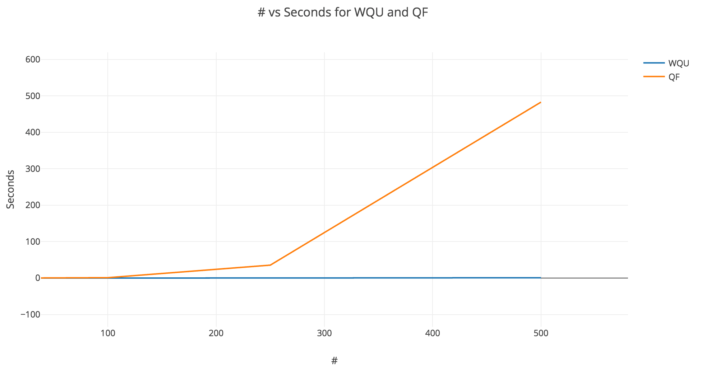
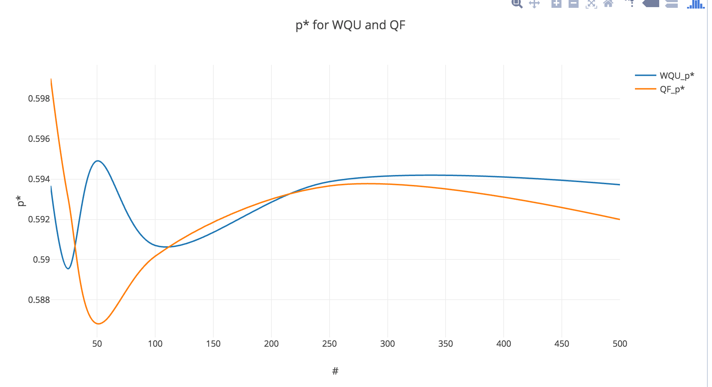

Ji Ma<br>
<a href="mailto:ma438@purdue.edu">ma438@purdue.edu</a>

#Percolation

All results are generated from MacBook Pro (Retina, 15-inch, Late 2013)


T=30 and N={10,25,50,100,250,500}

## Fast
```
10 30 fast
Mean Threshold = 0.5936666666666669
Standard Deviation = 0.0666169354740521
Total Time = 0.008
Mean time = 2.666666666666667E-4
stddev time = 6.396838299494916E-4

25 30 fast
Mean Threshold = 0.5895466666666669
Standard Deviation = 0.048724161911960974
Total Time = 0.015
Mean time = 5.000000000000002E-4
stddev time = 9.737945687202023E-4

50 30 fast
Mean Threshold = 0.5949066666666667
Standard Deviation = 0.029412816035300614
Total Time = 0.031
Mean time = 0.0010333333333333338
stddev time = 0.0012726115785600324

100 30 fast
Mean Threshold = 0.5907033333333332
Standard Deviation = 0.01793137268690776
Total Time = 0.069
Mean time = 0.0023000000000000013
stddev time = 0.00191455405809794

250 30 fast
Mean Threshold = 0.5938751999999998
Standard Deviation = 0.00853322673496638
Total Time = 0.181
Mean time = 0.006033333333333337
stddev time = 0.0035669298431209888

500 30 fast
Mean Threshold = 0.5937224
Standard Deviation = 0.0055099576417421865
Total Time = 0.848
Mean time = 0.028266666666666683
stddev time = 0.009864367548223087
```
## Slow
```
10 30 slow
Mean Threshold = 0.5990000000000001
Standard Deviation = 0.07415501006163629
Total Time = 0.014
Mean time = 4.666666666666668E-4
stddev time = 0.001136641554311871

25 30 slow
Mean Threshold = 0.5930666666666666
Standard Deviation = 0.03177946998682764
Total Time = 0.026
Mean time = 8.666666666666668E-4
stddev time = 0.0020800088417141874

50 30 slow
Mean Threshold = 0.5868133333333334
Standard Deviation = 0.02473283080321034
Total Time = 0.122
Mean time = 0.004066666666666669
stddev time = 0.0025179813114988496

100 30 slow
Mean Threshold = 0.5901700000000001
Standard Deviation = 0.01899295967566349
Total Time = 1.085
Mean time = 0.03616666666666667
stddev time = 0.006571009124901611

250 30 slow
Mean Threshold = 0.5936629333333333
Standard Deviation = 0.006780147160102323
Total Time = 35.466
Mean time = 1.1822000000000001
stddev time = 0.1157477638124651

500 30 slow
Mean Threshold = 0.5919939999999999
Standard Deviation = 0.004476928103217576
Total Time = 474.072
Mean time = 15.802400000000002
stddev time = 1.0383034437866947
```


### Running time


The difference between the Weighted Quick Union and Quick Find in terms of execution time is significant as we increase the size of N

The reason for this is because WQU is in log(N) time but QF is in N time.
### P* estimates


The p* is around 60%, nothing much difference between two algorithm. The result fo p* is kinda floating around in the beginning, but stablized when N increases.